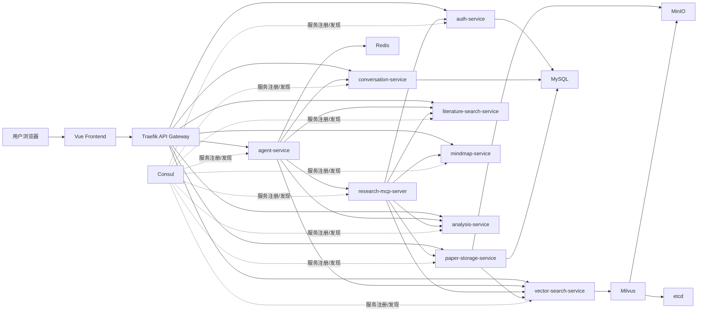
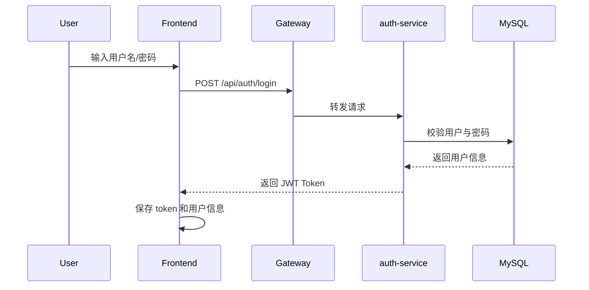
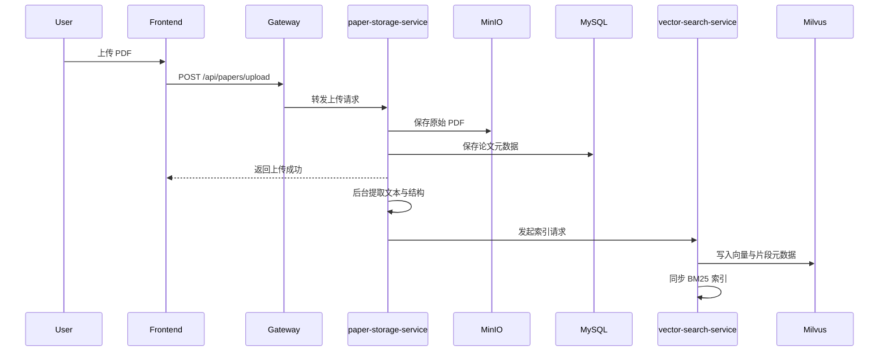
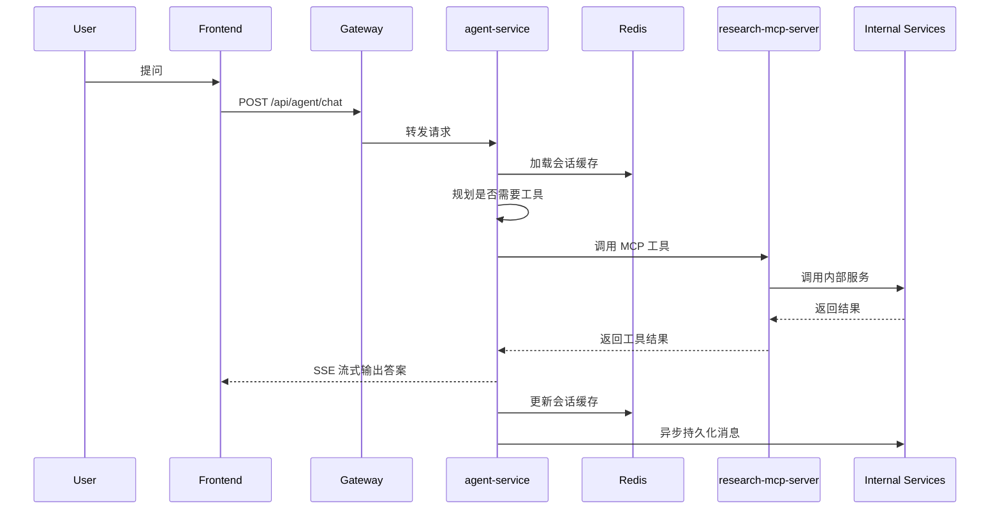

# ResearchGO 系统设计文档

## 1. 文档说明

本文档依据以下两类信息重新编写：

- 项目根目录中的系统设计 PPT：`ResearchGO 系统设计(1).pptx`
- 当前仓库中的前端、后端与部署代码实现

本文档**不参考仓库内其他说明文档**，以避免继承已过时的设计描述。若 PPT 与代码实现不一致，**以当前代码和 `docker-compose.yml` 中的实际部署结构为准**。

## 2. 项目概述

ResearchGO 是一个面向学术研究场景的 AI 学术研究助手系统，核心目标包括：

- 提供登录、会话管理、论文上传与论文库管理能力
- 提供外部学术文献检索与摘要生成能力
- 基于用户私有论文构建 RAG 检索与问答能力
- 提供论文分析、思维导图、阅读辅助等深度理解能力
- 通过 Agent 编排多种工具，形成“对话 + 检索 + 分析 + 生成”的统一研究工作台

从当前实现来看，系统采用：

- 前后端分离
- 微服务架构
- API 网关统一入口
- 对象存储 + 关系型数据库 + 向量数据库 + 缓存协同
- 以 `agent-service` 为核心的工具编排模式

## 3. 设计目标

### 3.1 业务目标

- 让用户以接近 ChatGPT 的低学习成本方式完成学术研究任务
- 打通“找论文、读论文、问论文、分析论文、沉淀会话”的完整链路
- 让系统同时支持公开文献知识和用户私有论文知识

### 3.2 技术目标

- 通过微服务拆分降低模块耦合度
- 通过网关和服务发现屏蔽内部服务地址变化
- 通过 Redis、异步写入与多层记忆降低 Agent 延迟
- 通过 MinIO + Milvus + MySQL 组合支持论文文件、元数据和向量检索
- 通过 MCP 工具层为 Agent 提供统一工具抽象

## 4. 总体架构

### 4.1 架构风格

系统采用分层与分服务结合的设计：

- 表现层：Vue 3 前端
- 接入层：Traefik API 网关
- 编排层：Agent Service、Research MCP Server
- 业务服务层：认证、会话、论文存储、向量检索、文献检索、论文分析、思维导图
- 数据层：MySQL、MinIO、Milvus、Redis、Consul、etcd

### 4.2 总体组件图

### 4.3 核心架构判断

从当前代码看，ResearchGO 不是单纯的“聊天系统 + 检索接口”，而是一个包含三条主线的研究平台：

- 面向公开文献的检索线：`literature-search-service`
- 面向私有论文的知识线：`paper-storage-service + vector-search-service`
- 面向复杂任务的智能编排线：`agent-service + research-mcp-server`

## 5. 部署架构设计

### 5.1 当前部署组件

根据 `docker-compose.yml`，当前部署包含以下组件：

| 层级 | 组件 | 作用 |
| --- | --- | --- |
| 接入层 | Traefik | 统一 API 入口、路由转发 |
| 服务治理 | Consul | 服务注册与发现 |
| 对象存储 | MinIO | 存储用户上传 PDF |
| 向量底座 | Milvus | 存储论文向量与片段元数据 |
| 向量依赖 | etcd | Milvus 元数据依赖 |
| 结构化存储 | MySQL | 用户、会话、论文元数据 |
| 缓存层 | Redis | 会话缓存、检查点、记忆相关缓存 |
| 辅助工具 | Attu | Milvus 可视化管理 |
| 预留组件 | RabbitMQ | 已部署但当前主链路未见显式使用 |

### 5.2 已接入的后端微服务

| 服务 | 端口 | 主要职责 |
| --- | --- | --- |
| `agent-service` | 8000 | Agent 编排、多轮对话、工具调用、流式输出、记忆系统 |
| `auth-service` | 8001 | 注册、登录、令牌校验、用户信息维护 |
| `conversation-service` | 8002 | 会话与消息持久化 |
| `paper-storage-service` | 8003 | PDF 上传、预览、下载、删除、索引触发 |
| `vector-search-service` | 8004 | 向量检索、论文问答、混合检索、索引管理 |
| `literature-search-service` | 8005 | OpenAlex 文献检索、详情、关联论文、摘要、引用导出 |
| `mindmap-service` | 8007 | 生成论文思维导图 |
| `analysis-service` | 8008 | 生成论文分析报告 |
| `research-mcp-server` | 8010 | 为 Agent 暴露统一 MCP 工具接口 |

### 5.3 遗留或未进入当前主链路的组件

- `chat-service` 代码仍存在于仓库中，但**未被当前 `docker-compose.yml` 接入部署链路**
- 因此当前系统设计应以 `agent-service` 为统一对话入口，而不是旧的 `chat-service`

## 6. 前端设计

### 6.1 技术选型

- Vue 3
- Vue Router
- Axios
- ECharts / Chart.js / D3
- jsMind
- Marked + Highlight.js
- KaTeX
- Markmap 相关库
- Vite

### 6.2 页面结构

当前路由对应的主要页面包括：

- `/`：落地页
- `/login`：登录页
- `/dashboard`：系统主页
- `/chat`：Agent 对话页
- `/literature`：文献检索页
- `/library`：论文库页
- `/review`：论文阅读分析工作台

### 6.3 前端交互特征

- 默认通过 Traefik 网关访问后端
- 在本地存储中保存 JWT Token
- 所有受保护接口通过 Axios 拦截器自动携带 `Authorization: Bearer <token>`
- 对话页面支持流式输出
- 阅读分析页面集成 PDF 预览、思维导图、分析报告与论文问答工作区

## 7. 核心模块设计

### 7.1 Agent 模块

`agent-service` 是系统核心编排器，当前实现基于 LangGraph 构建多节点执行图，核心节点包括：

- `prepare_context`
- `refresh_capabilities`
- `plan`
- `execute_tools`
- `handle_tool_outcome`
- `merge_tool_results`
- `handle_degraded`
- `handle_error`
- `synthesize_answer`
- `finalize`

其工作方式不是单轮“请求即回答”，而是更接近 ReAct 风格的循环：

1. 组装对话上下文
2. 加载会话摘要与长期记忆
3. 刷新可用工具
4. 让模型规划是否调用工具
5. 执行工具并吸收结果
6. 继续规划，直到可直接生成答案

### 7.1.1 Agent 记忆体系

根据代码实现，当前 Agent 具备多层记忆：

- 对话缓存：Redis 中缓存最近会话历史
- 对话持久化：异步落库到 `conversation-service`
- 滑动窗口：控制上下文长度
- 会话摘要：对长对话进行摘要压缩
- 语义记忆：为每个用户提取长期偏好、研究兴趣、任务上下文并写入 Markdown 文件
- Checkpointer：可选 Redis 检查点，用于 LangGraph 线程状态恢复

这意味着系统已经从“无状态问答”演进为“可恢复、可压缩、可长期记忆”的 Agent 系统。

### 7.2 MCP 工具层

`research-mcp-server` 的作用是：

- 为 Agent 暴露统一工具列表
- 将工具调用映射到内部业务服务
- 在工具层统一处理认证透传
- 为工具调用加入熔断与降级控制

当前工具能力覆盖：

- 文献检索与论文详情
- 关联论文获取
- 引用导出
- 用户论文搜索
- 语义检索
- 论文问答
- 论文分析
- 思维导图生成
- 多论文对比

因此 MCP 层在系统中的定位是“Agent 的工具抽象层”，而不是简单的代理转发层。

### 7.3 RAG 模块

RAG 主链路由 `paper-storage-service` 与 `vector-search-service` 共同完成。

### 7.3.1 论文入库流程

1. 用户上传 PDF 到 `paper-storage-service`
2. PDF 原文件写入 MinIO
3. 论文元数据写入 MySQL `papers` 表
4. 后台任务提取 PDF 文本
5. 优先使用 LLM 执行论文结构解析
6. 基于论文结构执行递归语义切分
7. 将切片向量写入 Milvus
8. 同步构建 BM25 索引

### 7.3.2 检索能力

当前实现已经不是单一向量检索，而是分为三层：

- Dense Search：基于 Embedding 的向量检索
- Sparse Search：基于 BM25 的关键词检索
- Hybrid Search：Dense + BM25 + RRF 融合 + Reranker 重排 + 查询翻译

因此系统的 RAG 已经具备较强的工程化特征：

- 支持私有论文问答
- 支持跨语言查询改写
- 支持结构化切片
- 支持重排提高片段相关性

### 7.4 文献检索模块

`literature-search-service` 面向公开学术文献，当前主要依赖 OpenAlex，并辅以 OpenAI 做摘要生成。主要能力包括：

- 文献检索
- 论文详情获取
- 相关论文获取
- 作者信息查询
- 结构化摘要生成
- BibTeX / RIS / APA / MLA 等格式导出

这条链路解决的是“公共学术知识获取”，与私有论文 RAG 能力形成互补。

### 7.5 论文分析模块

`analysis-service` 基于用户已上传的 PDF 生成结构化分析结果。结合前端 `PaperReview` 页面可知，分析结果至少包含：

- 标题
- 摘要
- 研究背景
- 研究问题
- 方法论
- 关键发现
- 创新点
- 局限性
- 未来工作
- 结论

该模块承担“机器阅读理解 + 结构化表达”的职责。

### 7.6 思维导图模块

`mindmap-service` 读取 MinIO 中的论文文件并生成思维导图数据，供前端在 `PaperReview` 页面中渲染。该模块承担“结构提炼与可视化表达”的职责。

### 7.7 会话模块

`conversation-service` 负责：

- 创建会话
- 获取会话列表
- 获取会话详情
- 更新会话标题
- 软删除会话
- 写入与读取消息

而 `agent-service` 并不直接承担全部会话持久化逻辑，而是通过 Redis 缓存与异步写入机制降低请求延迟。

### 7.8 认证模块

`auth-service` 负责：

- 注册
- 登录
- 获取当前用户信息
- 更新当前用户信息
- Token 校验
- 登出

认证方式为基于 JWT 的 Bearer Token。其他服务通过调用认证服务或透传令牌完成鉴权。

## 8. 关键业务流程

### 8.1 用户登录流程

### 8.2 论文上传与索引流程

### 8.3 Agent 对话流程

## 9. 数据设计

### 9.1 MySQL 数据设计

当前可明确识别的核心表包括：

| 表名 | 作用 |
| --- | --- |
| `users` | 用户账户 |
| `conversations` | 会话头信息 |
| `messages` | 会话消息 |
| `papers` | 论文元数据 |

### 9.1.1 `users`

关键字段：

- `id`
- `username`
- `email`
- `hashed_password`
- `is_active`
- `is_superuser`
- `created_at`
- `updated_at`

### 9.1.2 `conversations`

关键字段：

- `id`
- `user_id`
- `title`
- `created_at`
- `updated_at`
- `is_deleted`

### 9.1.3 `messages`

关键字段：

- `id`
- `conversation_id`
- `role`
- `content`
- `created_at`

### 9.1.4 `papers`

关键字段：

- `id`
- `user_id`
- `object_name`
- `original_name`
- `file_size`
- `content_type`
- `title`
- `authors`
- `year`
- `abstract`
- `created_at`
- `updated_at`

### 9.2 MinIO 对象设计

MinIO 中当前主要保存：

- 用户上传的 PDF 原始文件

对象名由时间戳与原始文件名组合生成，数据库中的 `object_name` 字段作为关联键。

### 9.3 Milvus 向量设计

当前 Collection 包含以下主要字段：

- `id`
- `paper_id`
- `chunk_id`
- `chunk_index`
- `embedding`
- `title`
- `file_name`
- `content`
- `chunk_chars`
- `page_range`
- `upload_time`
- `source`

其中：

- `page_range` 在当前实现中实际承载的是层级路径 `hierarchy_path`
- `source` 在当前实现中实际承载的是章节类型 `section_type`

因此向量层不仅保存相似度检索所需 embedding，也保存了结构化语义信息，便于后续重排和引用展示。

### 9.4 Redis 设计

Redis 当前主要承担：

- 会话历史缓存
- LangGraph Checkpointer
- Agent 运行时上下文支撑

缓存键至少包括：

- `conv_history:{conversation_id}`
- `conv_meta:{conversation_id}`

## 10. 接口设计

### 10.1 设计原则

- 前端默认通过网关统一访问后端
- 服务内部以 HTTP API 进行调用
- 外部接口遵循 REST 风格
- 需要认证的接口统一使用 Bearer Token
- Agent 对话使用 SSE 支持流式响应

### 10.2 网关路由

Traefik 当前已接入以下前缀路由：

- `/api/agent`
- `/api/auth`
- `/api/conversations`
- `/api/papers`
- `/api/vector`
- `/api/literature`
- `/api/mindmap`
- `/api/analysis`

### 10.3 关键外部接口

按当前实现，核心对外接口可分为：

- 认证接口：注册、登录、获取当前用户、校验 token
- 会话接口：创建会话、查询会话、追加消息、删除会话
- 论文接口：上传、列表、下载、预览、删除
- Agent 接口：对话、会话代理、工具查询、工具执行
- 向量接口：搜索、问答、索引、统计、删除
- 文献接口：搜索、详情、相关论文、作者信息、摘要、引用导出
- 思维导图接口：生成导图
- 分析接口：生成分析报告

### 10.4 内部服务调用关系

内部调用上存在几个典型模式：

- `agent-service -> conversation-service`
- `agent-service -> research-mcp-server`
- `paper-storage-service -> vector-search-service`
- `research-mcp-server -> 各业务服务`
- 各服务 -> `auth-service` 或令牌透传鉴权

## 11. 非功能设计

### 11.1 可扩展性

- 微服务拆分支持功能模块独立扩容
- MCP 工具注册机制支持新增工具能力
- RAG 流程将解析、切分、检索、重排解耦，便于替换模型和算法

### 11.2 可维护性

- 前后端分离
- 服务职责边界较清晰
- 网关与服务发现降低硬编码依赖
- Agent 图式编排比脚本式流程更便于扩展

### 11.3 性能设计

- 会话历史优先走 Redis
- 消息持久化异步写入
- 向量检索与 BM25 检索分层进行
- SSE 流式输出改善用户等待体验

### 11.4 可靠性设计

- 服务启动时进行健康检查
- 工具层引入熔断与降级
- 服务发现支持 Consul 优先、环境变量和 Docker DNS 回退
- Agent 在工具失败或降级时可重新规划

### 11.5 安全设计

- JWT 令牌认证
- 用户数据按 `user_id` 隔离
- 论文下载、预览、删除前进行权限校验
- 前端在 401 时自动清理令牌并跳回登录页

## 12. 当前实现与 PPT 对齐结论

### 12.1 与 PPT 保持一致的部分

- 系统整体采用微服务架构
- 存在 Agent 核心编排模块
- 存在 RAG 模块、UI 模块、接口设计、数据设计等分层
- 数据层使用 MySQL、MinIO、Milvus、Redis
- 前端采用 ChatGPT 风格的低学习成本交互

### 12.2 代码实现相对 PPT 的演进

- 已新增 `research-mcp-server`，形成独立工具抽象层
- RAG 已演进为混合检索，而非仅向量检索
- 论文索引已支持“结构解析 + 递归语义切分”
- Agent 已具备摘要记忆、滑动窗口、语义记忆、检查点等多层记忆能力
- 会话链路已通过 Redis 缓存和异步持久化做性能优化

### 12.3 当前需要特别注意的现实边界

- `chat-service` 仍在仓库中，但不属于当前主部署链路
- RabbitMQ 已部署，但当前主路径中未看到关键业务依赖
- 因此后续扩展和维护时，应继续围绕 `agent-service + research-mcp-server + RAG` 这条主架构推进

## 13. 结论

ResearchGO 当前已经不是简单的课程型 Demo，而是一个具备生产化骨架的学术研究辅助系统。其核心特征可以概括为：

- 以 Agent 为统一智能入口
- 以 MCP 为工具抽象层
- 以私有论文 RAG 和公开文献检索双知识源协同
- 以 MinIO + MySQL + Milvus + Redis 构成多模数据底座
- 以论文分析、思维导图和对话工作台形成完整研究闭环

若后续继续演进，建议优先围绕以下方向加强：

- 统一遗留接口与当前接口命名
- 明确启用与废弃组件边界
- 补齐服务级监控、审计与权限细粒度控制
- 完善多论文对比、引用图谱等研究增强能力
