# ResearchGO 需求分析文档

## 1. 文档概述

### 1.1 文档目的
本文档用于对 ResearchGO 项目进行系统化需求分析，明确系统目标、业务范围、参与者、主要功能需求与非功能需求，为后续的详细设计、开发实现、测试验收和项目汇报提供统一依据。

### 1.2 项目背景
ResearchGO 是一个面向科研学习与论文研究场景的智能辅助平台。系统以“论文获取、论文沉淀、智能检索、AI 对话、论文分析”作为核心业务链路，通过微服务架构整合认证、会话管理、论文存储、向量检索、文献检索、论文分析、思维导图生成等能力，帮助用户提高科研资料管理与论文理解效率。

### 1.3 分析范围
结合当前项目代码、页面功能与服务接口，本文档将系统需求划分为以下六个主要功能域：

1. 用户认证与身份管理
2. 学术文献检索与摘要导出
3. 论文库管理与论文资源维护
4. 论文语义检索与知识定位
5. Agent对话
6. 论文深度分析与思维导图生成

同时，文档补充系统级总用例图以及非功能需求。

### 1.4 术语说明

| 术语 | 含义 |
| --- | --- |
| 用户 | 使用系统进行科研检索、论文管理和 AI 分析的普通使用者 |
| 管理员 | 拥有更高权限，可进行系统维护或资源管理的用户 |
| OpenAlex | 外部学术文献检索数据源 |
| MinIO | 论文 PDF 文件对象存储服务 |
| Milvus | 向量数据库，用于语义检索 |
| JWT | 用户登录后获得的身份令牌 |
| 会话 | 用户与 AI 助手的一轮或多轮交流记录 |
| 论文对象名 | 系统内部用于标识论文文件的唯一名称 |

## 2. 系统总体分析

### 2.1 业务目标

1. 为科研用户提供统一的论文检索、管理、理解和问答入口。
2. 支持从“外部文献发现”到“本地论文沉淀”再到“智能分析”的完整科研辅助流程。
3. 利用大模型、向量检索与结构化分析提升论文阅读效率和知识复用能力。
4. 通过微服务方式保证系统可扩展性，便于后续继续增加引文图谱、推荐、协作等能力。

### 2.2 参与者分析

| 参与者 | 类型 | 说明 |
| --- | --- | --- |
| 普通用户 | 主要参与者 | 注册、登录、检索文献、上传论文、发起问答、生成分析结果 |
| 管理员 | 次要参与者 | 具备维护系统资源、管理向量集合等更高权限 |
| OpenAlex 平台 | 外部系统 | 提供海量学术文献检索与详情数据 |
| OpenAI 模型服务 | 外部系统 | 提供对话、摘要、分析、思维导图、向量嵌入等能力 |
| MinIO 对象存储 | 外部/基础设施 | 存储论文 PDF 原文 |
| Milvus 向量数据库 | 外部/基础设施 | 存储论文分块向量并支持语义检索 |
| MySQL | 外部/基础设施 | 存储用户、会话、论文元数据等结构化数据 |

### 2.3 系统总体用例图

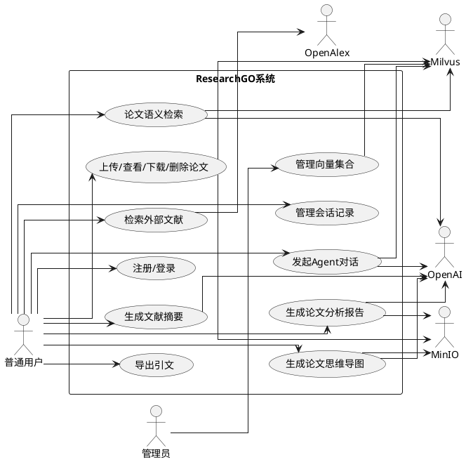

### 2.4 总体业务流程说明

1. 用户先通过认证模块完成注册与登录。
2. 用户可通过文献检索模块从 OpenAlex 搜索外部论文，并生成摘要或导出引文。
3. 用户可将本地 PDF 上传至论文库，系统在保存文件后自动提取文本并建立向量索引。
4. 用户可在论文库中对已上传论文进行语义检索，快速定位相关内容。
5. 用户可发起 Agent 对话，围绕任务或问题进行多轮交互，并保存对话历史。
6. 用户可选择论文生成深度分析报告与思维导图，辅助论文阅读与汇报。
7. 管理员可对向量数据资源进行维护。

### 2.5 系统总流程图

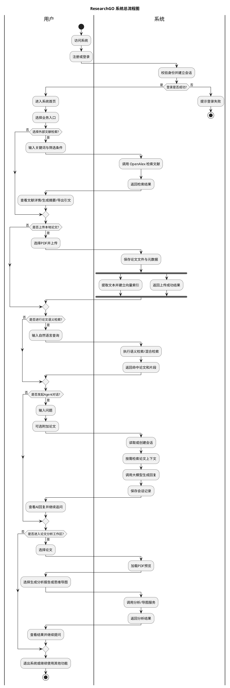

## 3. 主要功能需求

## 3.1 功能一：用户认证与身份管理

### 3.1.1 功能说明
该功能负责完成用户注册、登录、令牌校验、用户信息查询与退出登录，是其他业务功能的访问前提。

### 3.1.2 用例图

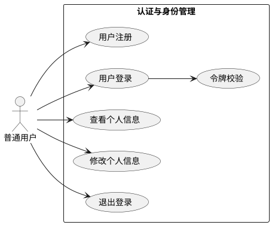

### 3.1.3 流程图

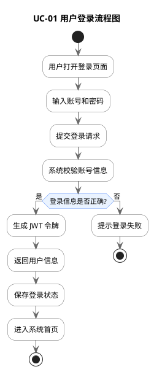

### 3.1.4 用例规约

| 项目 | 内容 |
| --- | --- |
| 用例名称 | 用户登录 |
| 描述对象 | 用户认证与身份管理模块中的登录业务 |
| 参与者 | 普通用户 |
| 前置条件 | 用户已注册；系统认证服务正常 |
| 基本事件流 | 1. 用户输入账号与密码。2. 前端提交登录请求。3. 系统校验账号是否存在。4. 系统校验密码是否正确。5. 系统校验账号状态是否可用。6. 系统签发 JWT 并返回用户信息。7. 前端保存令牌并跳转到业务首页。 |
| 扩展事件流 | 3a. 账号不存在，提示账号或密码错误。4a. 密码错误，提示账号或密码错误。5a. 用户被禁用，拒绝登录。 |
| 后置条件 | 用户获得有效 JWT；系统保存登录态。 |

### 3.1.5 详细功能点

1. 系统应支持用户注册，录入用户名、邮箱和密码。
2. 系统应支持用户名或邮箱登录。
3. 系统应对密码进行加密存储与比对。
4. 系统应返回统一格式的登录令牌和用户信息。
5. 系统应支持获取当前登录用户信息。
6. 系统应支持修改邮箱和密码。
7. 系统应支持退出登录。

## 3.2 功能二：学术文献检索与摘要导出

### 3.2.1 功能说明
该功能面向外部学术资源发现，支持用户基于关键词检索 OpenAlex 文献，按年份、被引次数、开放获取等条件筛选，并对单篇文献生成摘要、导出引文。

### 3.2.2 用例图

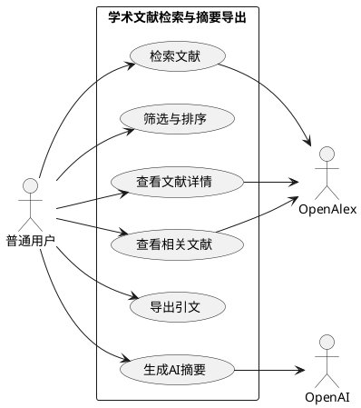

### 3.2.3 流程图

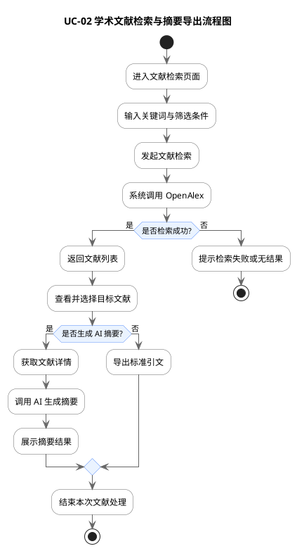

### 3.2.4 用例规约

| 项目 | 内容 |
| --- | --- |
| 用例名称 | 检索文献并生成摘要 |
| 描述对象 | 学术文献检索与摘要导出模块中的外部文献发现与摘要生成业务 |
| 参与者 | 普通用户 |
| 前置条件 | 用户已登录；外部文献服务可访问 |
| 基本事件流 | 1. 用户输入关键词。2. 用户可选择年份、引用次数、开放获取等筛选条件。3. 系统向外部文献数据源发起检索。4. 系统返回分页结果。5. 用户选择某篇文献查看详情。6. 用户点击生成摘要。7. 系统获取文献详细信息。8. 系统调用大模型生成结构化摘要。9. 系统展示摘要内容。 |
| 扩展事件流 | 3a. 外部数据源不可达，系统提示检索失败。7a. 文献缺少足够摘要信息，系统提示无法生成摘要。8a. 大模型服务失败，提示摘要生成失败。 |
| 后置条件 | 用户获得检索结果，并可查看选中文献的 AI 摘要。 |

### 3.2.5 详细功能点

1. 系统应支持关键词检索学术文献。
2. 系统应支持按发表年份区间筛选。
3. 系统应支持按最少被引次数筛选。
4. 系统应支持仅查看开放获取文献。
5. 系统应支持按相关性、被引次数、发表时间排序。
6. 系统应支持查看文献作者、摘要、期刊、DOI 等详情。
7. 系统应支持查看相关文献。
8. 系统应支持生成中文或英文结构化摘要。
9. 系统应支持导出标准引文格式。
10. 系统应支持将外部文献信息带入对话场景。

## 3.3 功能三：论文库管理与论文资源维护

### 3.3.1 功能说明
该功能用于管理用户上传到平台的论文 PDF，支持上传、列表查看、在线预览、下载和删除，同时触发后续索引构建。

### 3.3.2 用例图

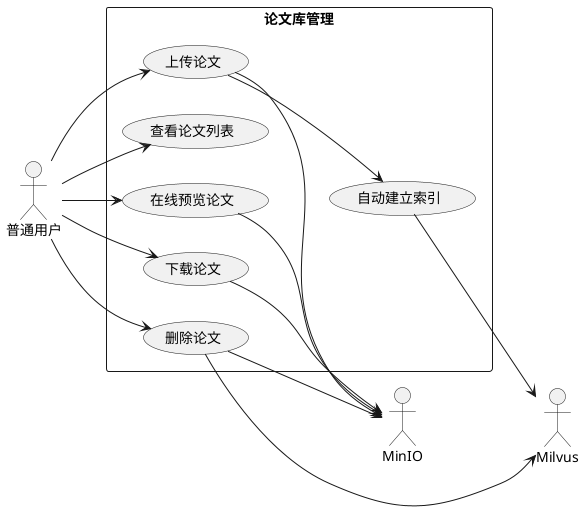

### 3.3.3 流程图

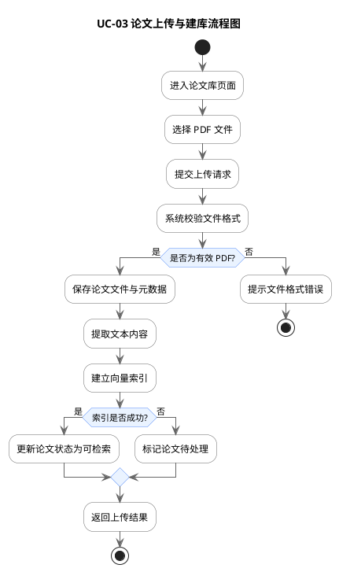

### 3.3.4 用例规约

| 项目 | 内容 |
| --- | --- |
| 用例名称 | 上传论文 |
| 描述对象 | 论文库管理与论文资源维护模块中的论文上传与建库业务 |
| 参与者 | 普通用户 |
| 前置条件 | 用户已登录；上传文件为 PDF；存储服务正常 |
| 基本事件流 | 1. 用户选择 PDF 文件。2. 前端提交上传请求。3. 系统校验文件类型。4. 系统将文件存入对象存储。5. 系统保存论文元数据。6. 系统返回上传成功结果。7. 系统在后台提取文本并建立向量索引。 |
| 扩展事件流 | 3a. 文件不是 PDF，拒绝上传。4a. 对象存储失败，提示上传失败。7a. 索引失败，论文仍保留在库中，但检索功能暂不可用。 |
| 后置条件 | 论文文件存入对象存储；论文元数据写入数据库；论文进入可检索状态或等待索引完成。 |

### 3.3.5 详细功能点

1. 系统应支持 PDF 文件上传。
2. 系统应支持展示用户论文列表。
3. 系统应展示论文名称、大小、上传时间等元数据。
4. 系统应支持论文在线预览。
5. 系统应支持论文下载。
6. 系统应支持论文删除。
7. 系统应在上传成功后自动触发文本提取与索引构建。
8. 系统应在删除论文时联动删除向量索引。

## 3.4 功能四：基于RAG的论文问答

### 3.4.1 功能说明
该功能面向用户已上传论文库，利用 RAG 机制完成“问题输入、相关片段检索、上下文组装、模型生成回答”的闭环，为用户提供基于论文内容的精准问答能力。

### 3.4.2 用例图

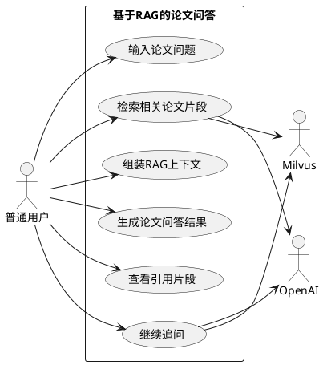

### 3.4.3 流程图

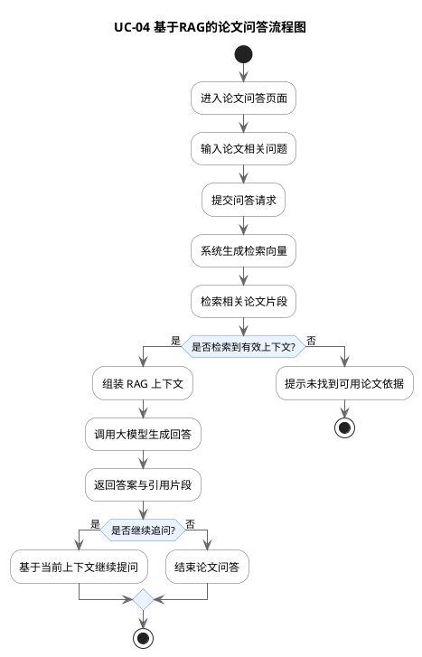

### 3.4.4 用例规约

| 项目 | 内容 |
| --- | --- |
| 用例名称 | 基于RAG的论文问答 |
| 描述对象 | 基于RAG的论文问答模块中的论文内容问答业务 |
| 参与者 | 普通用户 |
| 前置条件 | 用户已登录；论文库中存在已完成索引的论文 |
| 基本事件流 | 1. 用户输入论文相关问题。2. 系统将问题转换为向量检索请求。3. 系统在向量库中检索相关论文片段。4. 系统组装检索结果与问题形成 RAG 上下文。5. 系统调用大模型生成回答。6. 系统返回答案及引用依据。7. 用户查看结果并决定是否继续追问。 |
| 扩展事件流 | 3a. 向量库不可用，返回问答失败。3b. 没有检索到相关片段，提示缺少论文依据。5a. 大模型调用失败，提示回答生成失败。 |
| 后置条件 | 用户获得基于论文内容生成的回答及引用片段。 |

### 3.4.5 详细功能点

1. 系统应支持用户输入论文相关自然语言问题。
2. 系统应支持从论文向量库中检索相关内容片段。
3. 系统应支持将检索片段与用户问题组装为 RAG 上下文。
4. 系统应支持生成带有论文依据的问答结果。
5. 系统应展示命中片段内容、来源论文和引用依据。
6. 系统应支持围绕当前论文问答结果继续追问。

## 3.5 功能五：Agent对话

### 3.5.1 功能说明
该功能提供用户与 Agent 的多轮交互能力。Agent 能够理解用户意图、结合上下文选择合适能力服务完成任务，并以连续对话形式返回结果。

### 3.5.2 用例图

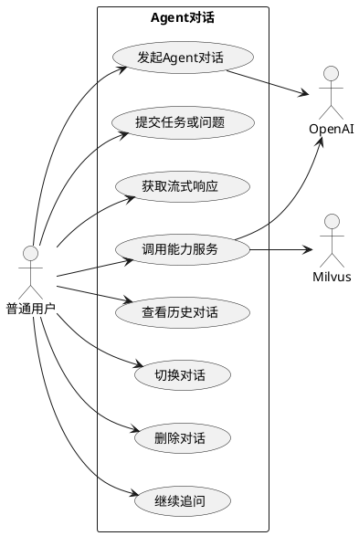

### 3.5.3 流程图

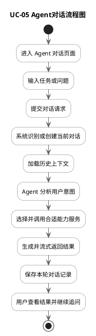

### 3.5.4 用例规约

| 项目 | 内容 |
| --- | --- |
| 用例名称 | 发起Agent对话 |
| 描述对象 | Agent对话模块中的多轮任务交互业务 |
| 参与者 | 普通用户 |
| 前置条件 | 用户已登录；Agent 服务可用 |
| 基本事件流 | 1. 用户输入任务或问题。2. 系统识别当前对话，不存在则自动创建。3. 系统加载历史上下文。4. Agent 分析用户意图并选择处理策略。5. Agent 调用对应能力服务。6. 系统以流式方式返回处理结果。7. 系统保存用户输入与 Agent 输出。 |
| 扩展事件流 | 2a. 对话服务不可用，提示无法保存或读取历史。5a. 能力服务调用失败，返回降级结果或错误提示。6a. 流式返回中断，系统提示本轮结果不完整。 |
| 后置条件 | 当前对话新增一轮交互记录，Agent 输出被保存并可再次查看。 |

### 3.5.5 详细功能点

1. 系统应支持自动创建新的 Agent 对话。
2. 系统应支持查看 Agent 对话列表。
3. 系统应支持切换历史对话并恢复上下文。
4. 系统应支持删除对话记录。
5. 系统应支持多轮连续追问。
6. 系统应支持流式展示 Agent 返回结果。
7. 系统应支持 Agent 根据意图调用不同能力服务。
8. 系统应支持保留任务上下文与执行结果。
9. 系统应支持对话记录持久化与缓存加速。

## 3.6 功能六：论文深度分析与思维导图生成

### 3.6.1 功能说明
该功能面向单篇论文的深度理解，支持选中论文后生成结构化分析报告、论文思维导图，并在同一工作空间中结合 PDF 浏览与 AI 助手辅助阅读。

### 3.6.2 用例图

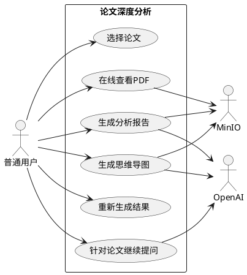

### 3.6.3 流程图

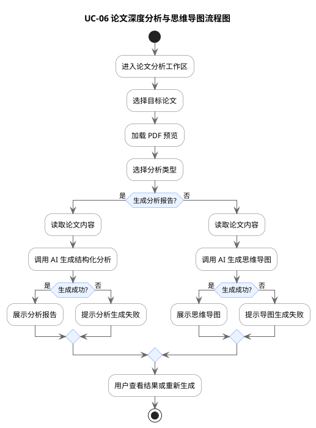

### 3.6.4 用例规约

| 项目 | 内容 |
| --- | --- |
| 用例名称 | 生成论文分析报告与思维导图 |
| 描述对象 | 论文深度分析与思维导图生成模块中的单篇论文深度解读业务 |
| 参与者 | 普通用户 |
| 前置条件 | 用户已登录；已上传并可访问目标论文；分析服务正常 |
| 基本事件流 | 1. 用户从论文列表选择论文。2. 系统加载 PDF 预览。3. 用户选择生成分析报告或思维导图。4. 系统读取论文文件内容。5. 系统调用大模型生成结构化分析结果或思维导图结构。6. 系统返回相应结果。7. 前端展示分析报告或思维导图。 |
| 扩展事件流 | 1a. 用户未选择论文，系统提示先选择论文。4a. 文件读取失败，生成终止。5a. 大模型服务失败，提示生成失败。5b. 思维导图结构不完整，系统提示重新生成。 |
| 后置条件 | 用户获得论文分析报告或思维导图结果，并可在界面中浏览或重新生成。 |

### 3.6.5 详细功能点

1. 系统应支持从论文库中选择待分析论文。
2. 系统应支持在工作区中在线查看论文 PDF。
3. 系统应支持生成结构化分析报告。
4. 分析报告至少应包含题目、摘要、背景、问题、方法、关键发现、创新点、局限、未来工作、结论。
5. 系统应支持生成论文思维导图。
6. 系统应支持重新生成分析和导图结果。
7. 系统应支持在分析工作区继续向 AI 助手提问。
8. 系统应支持为后续引文图谱等扩展功能预留入口。

## 3.7 功能七：向量资源管理（管理员）

### 3.7.1 功能说明
该功能主要面向管理员或高级运维用户，用于查看向量集合状态、创建集合、加载/释放集合和删除集合，以保障语义检索能力可维护。

### 3.7.2 用例图

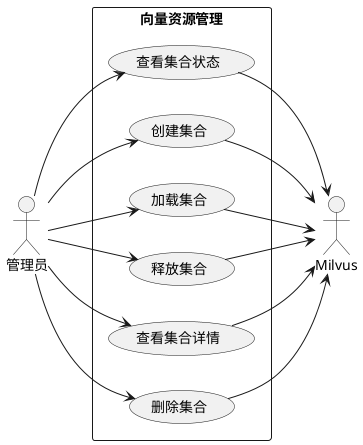

### 3.7.3 流程图

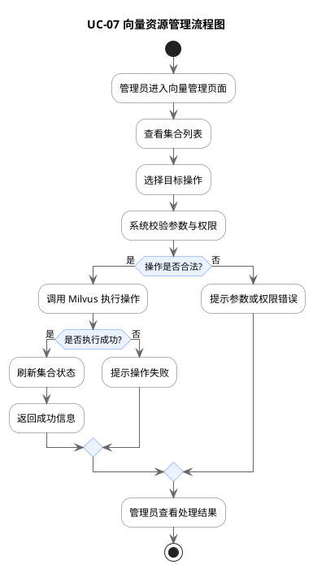

### 3.7.4 用例规约

| 项目 | 内容 |
| --- | --- |
| 用例名称 | 管理向量集合 |
| 描述对象 | 向量资源管理模块中的集合维护业务 |
| 参与者 | 管理员 |
| 前置条件 | 管理员已登录；向量数据库服务正常 |
| 基本事件流 | 1. 管理员查看当前集合列表与统计信息。2. 管理员选择创建、加载、释放或删除集合。3. 系统校验参数与权限。4. 系统调用向量数据库执行操作。5. 系统返回执行结果并刷新页面状态。 |
| 扩展事件流 | 3a. 参数非法，提示用户修正。4a. 向量数据库不可用，提示操作失败。 |
| 后置条件 | 指定集合状态被更新或被删除或创建。 |

### 3.7.5 详细功能点

1. 系统应支持查看集合数量、向量数量和加载状态。
2. 系统应支持创建新集合并设置向量维度。
3. 系统应支持加载集合到内存。
4. 系统应支持释放集合。
5. 系统应支持查看集合详情。
6. 系统应支持删除集合，并提供强确认提示。

## 4. 非功能需求

## 4.1 性能需求

1. 普通页面请求的平均响应时间宜不超过 3 秒。
2. 文献检索结果首屏返回时间宜不超过 5 秒。
3. AI 对话应支持流式返回，首个响应片段应尽快显示。
4. 论文上传后应在后台异步建立索引，避免长时间阻塞前端。
5. 系统应支持分页、缓存等机制减少大数据量场景下的卡顿。

## 4.2 可用性需求

1. 系统主要业务流程应具备清晰的状态提示，包括加载中、成功、失败、无结果等。
2. 外部服务异常时系统应向用户返回明确错误信息，而不是直接崩溃。
3. 系统应支持在网络波动时进行合理重试或降级。
4. 会话、论文、检索结果等页面在移动端和桌面端都应能正常访问。

## 4.3 安全性需求

1. 系统应对受保护接口进行身份认证。
2. 系统应使用 JWT 作为访问令牌。
3. 用户仅可访问属于自己的会话和论文资源。
4. 用户密码应加密存储，不得明文保存。
5. 文件上传应校验类型，避免非法文件进入系统。
6. 管理类操作应具备权限控制和风险提示。

## 4.4 可靠性需求

1. 论文上传成功后，即使索引失败，也不应导致原文件丢失。
2. 对话消息应尽量持久化保存，避免因单次请求失败造成历史丢失。
3. 删除论文时应保证文件存储、数据库记录和向量索引尽量保持一致。
4. 系统对外部依赖异常应具备容错和日志记录能力。

## 4.5 可维护性需求

1. 系统应采用模块化、微服务化设计，便于功能拆分与扩展。
2. 各服务接口应尽量保持职责清晰，便于定位和维护。
3. 系统应保留健康检查接口，便于运维监控。
4. 代码应支持后续加入配置中心、服务发现、熔断、限流等能力。

## 4.6 可扩展性需求

1. 系统应支持未来新增引文图谱、论文推荐、协同标注等模块。
2. 文献数据源应支持后续扩展到更多学术数据库。
3. 检索能力应支持从基础向量检索逐步升级到混合检索与重排序。
4. AI 能力应支持切换不同模型与不同分析模板。

## 4.7 兼容性需求

1. 前端应兼容现代主流浏览器。
2. 系统应支持基于容器的部署方式。
3. 前后端接口应保持清晰的 REST 风格，便于联调与替换。

## 4.8 可观测性需求

1. 系统应记录关键业务日志，包括登录、上传、检索、分析、问答等行为。
2. 系统应提供服务健康检查接口。
3. 系统应具备后续接入监控、追踪和告警体系的条件。

## 5. 约束与假设

### 5.1 约束条件

1. 系统依赖外部大模型服务和外部文献检索服务。
2. 论文语义检索依赖向量数据库可用。
3. 论文分析与思维导图结果质量受论文文本提取质量影响。
4. 系统当前部分功能处于已实现与规划并存状态，需求分析需兼顾现有能力与明确展示的扩展方向。

### 5.2 假设条件

1. 使用者具备基础的论文检索与阅读需求。
2. 平台部署环境可提供 MySQL、MinIO、Milvus 等基础组件。
3. 系统默认面向单用户个人科研使用场景，暂不重点讨论多人协作流程。

## 6. 验收建议

### 6.1 功能验收建议

1. 用户能够完成注册、登录、查看个人信息与退出。
2. 用户能够成功检索外部文献，并可生成摘要与导出引文。
3. 用户能够上传、预览、下载、删除论文。
4. 用户能够对已上传论文进行语义检索并查看匹配片段。
5. 用户能够进行多轮 AI 对话并查看历史会话。
6. 用户能够针对指定论文生成分析报告与思维导图。
7. 管理员能够查看和维护向量集合。

### 6.2 非功能验收建议

1. 关键页面在正常网络下响应流畅。
2. 登录权限控制生效，未登录用户无法访问受限页面。
3. 错误场景下系统提示明确，不出现空白页面或不可恢复异常。
4. 文件与会话数据在刷新后仍可保留。

## 7. 结论
ResearchGO 的需求核心在于构建一条完整的科研辅助链路：从外部文献发现，到本地论文沉淀，再到语义检索、智能问答和深度分析。系统在功能上兼具“论文管理平台”和“AI 科研助手”双重属性，在架构上则具备向平台化科研智能系统演进的基础。后续若继续完善引文图谱、推荐系统、运维治理和可观测性能力，系统可进一步升级为更完整的科研知识工作台。

